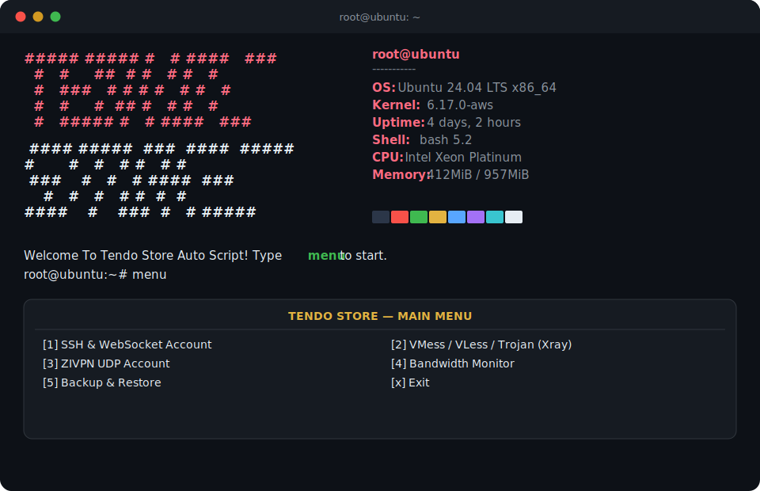
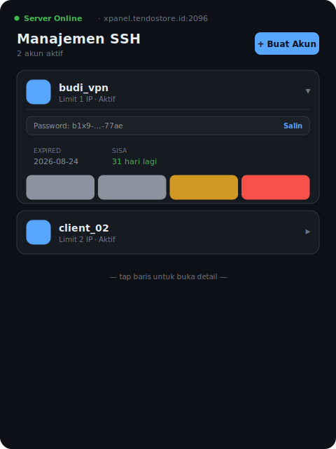

<div align="center">

# ⚡ Auto Script All Protokol VPN — Tendo Store

**Auto-installer 1‑klik untuk SSH/WS, Xray (VMess · VLess · Trojan), dan ZIVPN UDP**
**lengkap dengan Web Admin Panel bertema gelap, Bot Notifikasi Telegram, dan sistem manajemen akun otomatis.**

[](#)
[](#)
[](#)
[](#)
[](LICENSE)
[](https://github.com/tendostore/Auto-Script-All-Protokol-Vpn)

[Fitur](#-fitur-utama) •
[Preview](#-preview) •
[Instalasi](#-instalasi) •
[Menu](#-struktur-menu) •
[Port & Protokol](#-port--protokol) •
[Admin Panel](#-web-admin-panel) •
[FAQ](#-faq) •
[Kontak](#-kontak--support)

</div>

---

## 📖 Tentang

**Auto Script All Protokol VPN** adalah script instalasi otomatis untuk VPS Ubuntu/Debian yang menyulap server baru menjadi **server multi-protokol VPN siap jual** hanya dalam satu kali perintah. Cocok untuk reseller VPN, penyedia layanan tunneling, maupun keperluan pribadi.

Script ini menangani seluruh proses berat secara otomatis: instalasi dependency, compile Dropbear, setup Xray-core, konfigurasi Nginx/stunnel, firewall, fail2ban, cron job kedaluwarsa akun, hingga Web Admin Panel — tanpa perlu konfigurasi manual satu per satu.

---

## ✨ Fitur Utama

### 🌐 Multi-Protokol
- **SSH & SSH WebSocket (WS)** — dengan Dropbear custom (port 90), OpenSSH, dan stunnel TLS
- **Xray-core**: **VMess**, **VLess** (+ XTLS Vision fallback di port 443), **Trojan**
- Transport lengkap per protokol: **WS**, **gRPC**, **HTTP Upgrade** — TLS & Non-TLS
- **ZIVPN UDP** untuk koneksi berbasis UDP (gaming/streaming friendly)
- **BadVPN UDPGW** bawaan untuk tunneling UDP di atas SSH

### 🛠️ Manajemen Akun Otomatis
- Buat, hapus, renew, kunci/buka akun hanya dengan sekali input
- **Limit IP per akun** & **limit kuota bandwidth** (auto-expired & auto-lock)
- Cron job harian: cek masa aktif akun, cek limit IP, hitung pemakaian kuota
- Trial account instan untuk testing

### 🖥️ Web Admin Panel (Flask)
- Dashboard real-time: jumlah akun per protokol, CPU, RAM, disk, bandwidth live
- **Tampilan account list bergaya accordion card** (mobile-friendly, dark theme) — bukan tabel HTML biasa
- Detail akun, copy config sekali klik, renew & kunci akun langsung dari browser
- Auth berbasis session, aman untuk diakses dari HP maupun desktop

### 🤖 Notifikasi Telegram
- Bot notifikasi otomatis saat ada **login user baru**
- Notifikasi **backup otomatis** terjadwal
- Detail akun baru langsung dikirim ke Telegram admin/reseller

### 🔒 Keamanan
- **Fail2ban** dengan filter khusus untuk Dropbear & WS-Proxy (deteksi IP asli di balik proxy)
- Auto-lock akun saat IP melebihi limit
- Firewall & iptables-persistent terkonfigurasi otomatis

### 📦 Utilitas Tambahan
- Backup & restore seluruh data VPS
- Monitoring bandwidth (live / 5 menit / harian / bulanan) via `vnstat`
- Speedtest & benchmark server langsung dari menu CLI
- Ganti domain, ganti banner SSH, semua dari menu — tanpa edit file manual

---

## 🖼️ Preview

<div align="center">

**Tampilan CLI saat login SSH**



**Web Admin Panel — Account List (Accordion Card UI)**



</div>

> 💡 Preview di atas adalah ilustrasi tampilan (mockup) yang merepresentasikan struktur & tema warna asli dari script ini. Tampilan sesungguhnya di server kamu akan menampilkan data real-time.

---

## ⚙️ Requirement

| Kebutuhan | Spesifikasi Minimum |
|---|---|
| OS | Ubuntu 20.04 / 22.04 / 24.04, atau Debian 11 / 12 (fresh install) |
| RAM | 512 MB (disarankan 1 GB+) |
| Storage | 10 GB free space |
| Akses | Root / sudo |
| Domain | Domain/subdomain yang sudah di-pointing ke IP VPS |

---

## 🚀 Instalasi

```bash
apt update -y && apt install -y curl
curl -fsSL -O https://raw.githubusercontent.com/tendostore/Auto-Script-All-Protokol-Vpn/main/install.sh
chmod +x install.sh
./install.sh
```

Ikuti instruksi di layar (input domain, dsb). Setelah instalasi selesai, VPS akan otomatis **reboot**. Login kembali via SSH untuk melihat banner info server, lalu ketik:

```bash
menu
```

untuk membuka menu utama.

---

## 📋 Struktur Menu

```
┌──────────────────────────────────────────────────────┐
│                 TENDO STORE - MAIN MENU               │
├──────────────────────────────────────────────────────┤
│  [1]  SSH & WebSocket Account                         │
│  [2]  Xray Account (VMess / VLess / Trojan)            │
│  [3]  ZIVPN UDP Account                                │
│  [4]  Bandwidth Monitor                                │
│  [5]  Speedtest                                        │
│  [6]  Benchmark Server                                 │
│  [7]  Cek Service / Restart Service                    │
│  [8]  Ganti Domain VPS                                 │
│  [9]  Ganti Banner SSH                                 │
│ [10]  Backup Data VPS                                  │
│ [11]  Restore Data VPS                                 │
│ [12]  Setup Bot Telegram                                │
│  [x]  Keluar                                           │
└──────────────────────────────────────────────────────┘
```

Setiap sub-menu (SSH, Xray, ZIVPN) punya opsi yang sama: **Create · Delete · Renew · Trial · Lock · Unlock · Check Config**.

---

## 🔌 Port & Protokol

| Layanan | Port |
|---|---|
| OpenSSH | `22` |
| Dropbear | `90` |
| SSH/WS + Xray TLS | `443` |
| SSH/WS + Xray Non-TLS | `80` |
| Alternatif TLS | `8443` |
| Alternatif Non-TLS | `8080` |
| Multi-port | `2082`, `2083`, `8880` |
| UDPGW (BadVPN) | `7100–7600` |

Path default: `/vmess`, `/vless`, `/trojan` (WS) — `vmess-grpc`, `vless-grpc`, `trojan-grpc` (gRPC) — `/vmess-upg`, `/vless-upg`, `/trojan-upg` (HTTP Upgrade).

---

## 🖥️ Web Admin Panel

Panel admin berbasis Flask bisa diakses melalui browser:

```
https://domainkamu.com:2096
```

Fitur panel:
- Login aman berbasis session
- Dashboard ringkas: jumlah akun tiap protokol, resource server, bandwidth live
- List akun bergaya **card accordion** — tap untuk lihat detail, copy kredensial, renew, atau kunci akun
- Modal detail config lengkap (siap disalin ke client VPN)
- Pengaturan bot Telegram langsung dari panel

---

## ❓ FAQ

**Q: Apakah script ini bisa dijalankan ulang / update tanpa reinstall total?**
A: Bisa. Script mendukung mode update yang menjaga data akun yang sudah ada.

**Q: Apakah wajib pakai domain?**
A: Ya, untuk TLS (HTTPS) diperlukan domain yang sudah di-pointing ke IP VPS.

**Q: OS apa saja yang didukung?**
A: Ubuntu 20.04/22.04/24.04 dan Debian 11/12 — disarankan menggunakan instalasi **fresh/bersih**.

**Q: Bagaimana cara backup sebelum reinstall VPS?**
A: Gunakan menu `[10] Backup Data VPS` dari menu utama, lalu simpan hasil backup ke lokal sebelum reinstall.

---

## ⚠️ Disclaimer

Script ini disediakan **as-is** untuk tujuan pembelajaran dan operasional layanan VPN pribadi/reseller. Gunakan sesuai dengan hukum dan regulasi yang berlaku di wilayah kamu. Penulis tidak bertanggung jawab atas penyalahgunaan script ini.

---

## 🤝 Kontribusi

Pull request & issue sangat diterima! Untuk perubahan besar, mohon buka issue terlebih dahulu untuk diskusi.

1. Fork repository ini
2. Buat branch baru (`git checkout -b fitur-baru`)
3. Commit perubahan (`git commit -m 'Tambah fitur X'`)
4. Push ke branch (`git push origin fitur-baru`)
5. Buka Pull Request

---

## 📬 Kontak & Support

- **Telegram:** [@tendo_32](https://t.me/tendo_32)
- **WhatsApp:** [+62 822-2446-0678](https://wa.me/6282224460678)
- **Owner:** Tendo Store

---

## 📄 Lisensi

Didistribusikan di bawah lisensi **MIT**. Lihat [`LICENSE`](LICENSE) untuk info lebih lanjut.

<div align="center">

Dibuat dengan ❤️ oleh **Tendo Store**

⭐ Jangan lupa kasih **star** kalau script ini membantu!

</div>
